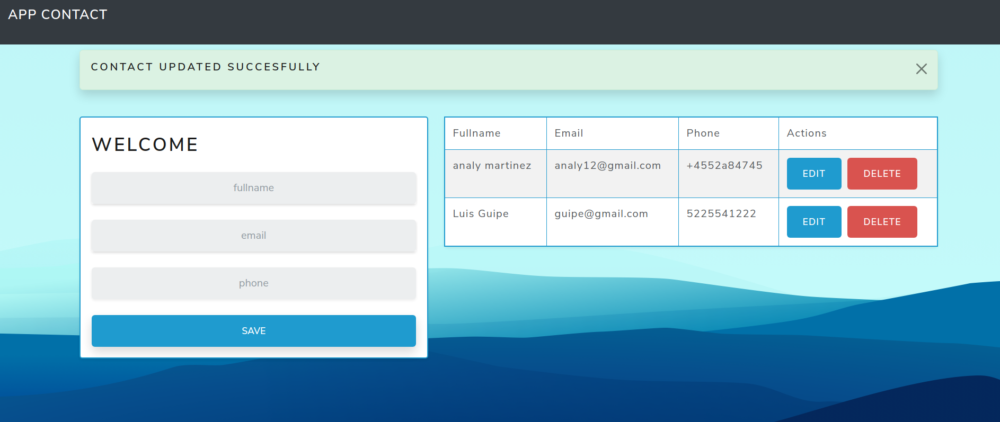
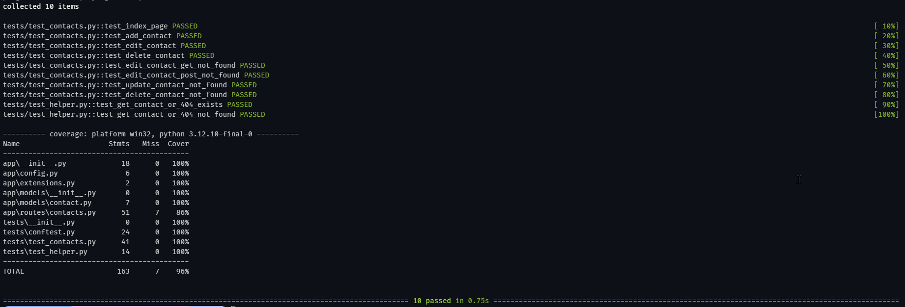

# 📇 Flask CRUD Contacts App

**CRUD (Create, Read, Update, Delete) web application** for managing contacts, built with **Flask** and **SQLite3**.  
This project is part of my **professional portfolio** and demonstrates best practices in Python backend development, including **linting and code quality with Ruff**.

---

## 🎯 Project Goal

- Build a full-featured web application using **Flask**  
- Implement CRUD operations with **SQLite3**  
- Apply best practices for code organization and readability  
- Maintain code quality using modern Python tools  

---

## 🚀 Features

- 📌 Create contacts  
- 📋 List contacts  
- ✏️ Edit contacts  
- 🗑️ Delete contacts  
- 🎨 Responsive interface with **Bootstrap**  
- 🧪 Basic tests  
- 🧹 Code validated with **Ruff**  

---

## 🛠️ Technologies Used

- **Python** 3.9.5  
- **Flask**  
- **SQLite3**  
- **HTML5**  
- **CSS3**  
- **Bootstrap**  
- **Ruff** (linting and code quality)  

---

## 📦 Requirements

Before running the application:

- Python 3.9.5 or higher  
- Pip  

> 💡 SQLite3 comes included with Python by default, so no additional installation is required.  

---

## ⚙️ Installation and Running

1. Clone the repository:
   ```bash
   git clone https://github.com/userlg/Flask-Contact-App

   cd Flask-Contact-App
    
    # Activate the virtual enviorment
   .venv/Script/activate

   # Install all dependencies
   pip install -r requirements.txt

   python run.py

   # Open the web browser
   http://localhost:5000
   ```

## Ruff
   ```bash
   ruff check --fix
```

## Screenshots





## Test Coverage


